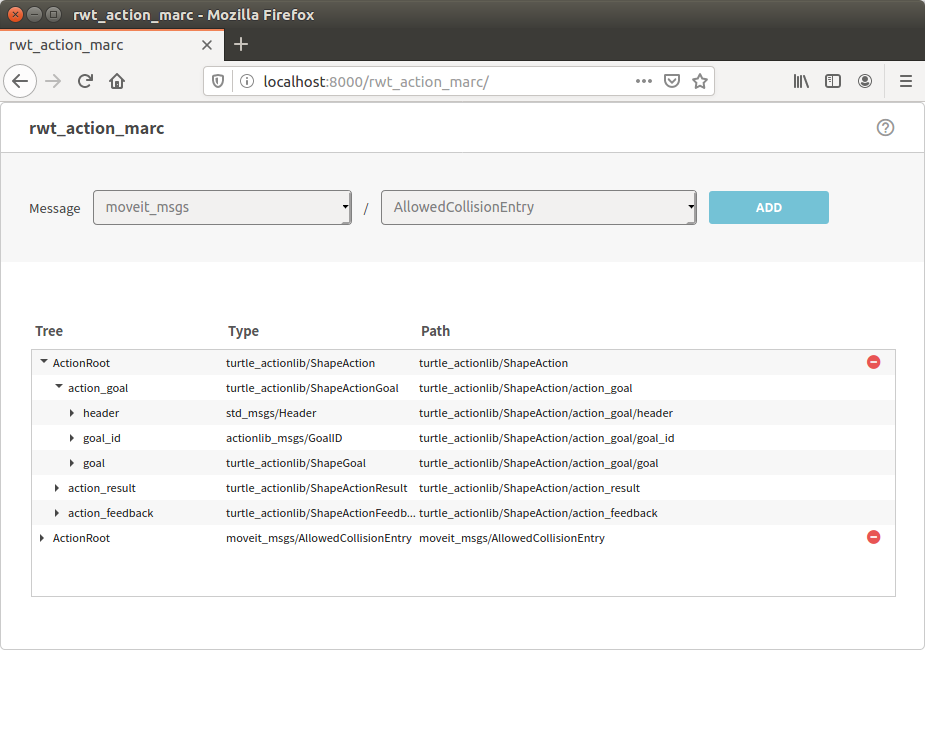

rwt_action_marc
========

Usage
-----
```sh
roslaunch rwt_action_marc example.launch # this starts roswww and rosbridge_server and example data publisher
```

and access to http://localhost:8000/rwt_action_marc/ using your browser


