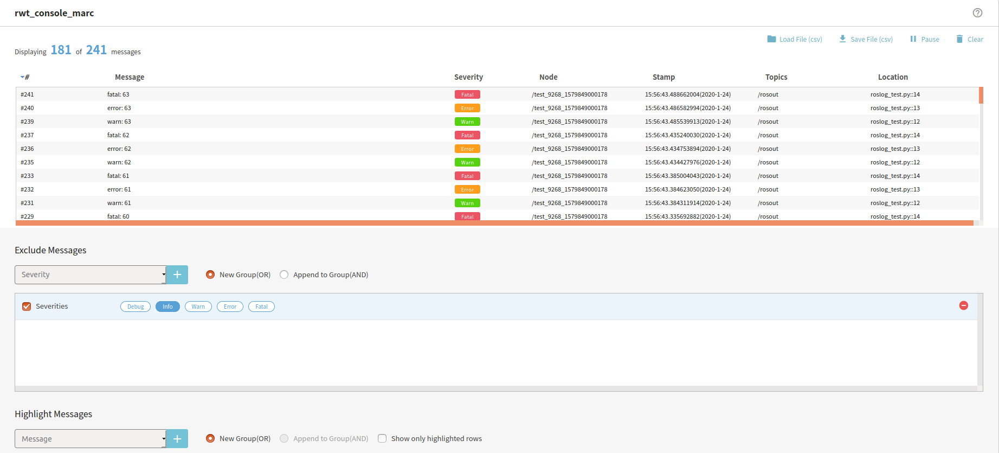

rwt_console_marc
========

Usage
-----
```sh
roslaunch rwt_console_marc rwt_console_marc.launch # this starts roswww and rosbridge_server
```

and access to http://localhost:8000/rwt_console_marc/ using your browser



Dependencies
------------
All the dependending projects are included in `rwt_console_marc` and `rwt_utils_3rdparty`

* [SlickGrid](https://slickgrid.net/Index.html) - spreadsheet library
* [lodash](https://github.com/lodash/lodash) - utlity functions