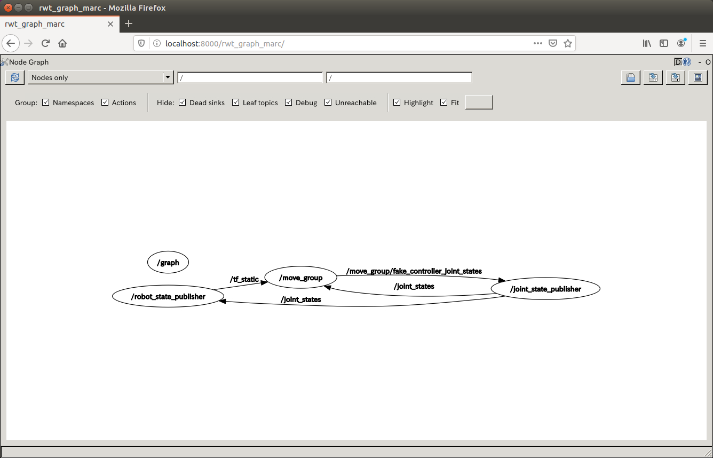

rwt_graph_marc
==============

Installation
------------
1. Install
 [TigerVNC Server](https://tigervnc.org/),
 [Ratpoison](https://www.nongnu.org/ratpoison/) and
 [Websockify](https://github.com/novnc/websockify)

2. Build ROS package
    ```
    cd <your_catkin_ws>/src

    git clone https://github.com/robo-marc/visualization_rwt.git

    rosdep install --ignore-src --from-paths visualization_rwt/rwt_graph_marc -y

    catkin build rwt_graph_marc

    source <your_catkin_ws>/devel/setup.bash
    ```

Usage
-----
```sh
roslaunch rwt_graph_marc rwt_graph_marc.launch
```

and access to http://localhost:8000/rwt_graph_marc/ using your browser


