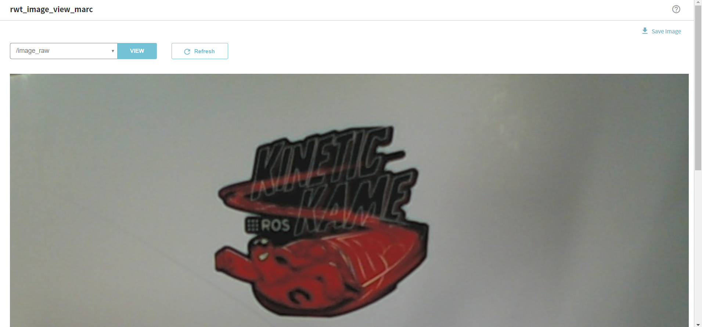

rwt_image_view
==============

Usage
-----
```sh
roslaunch rwt_image_view_marc example.launch # this starts roswww and rosbridge_server and image_server
```

and access to http://localhost:8000/rwt_image_view_marc/ using your browser



Dependencies
------------
All the dependending projects are included in `rwt_plot_marc` and `rwt_utils_3rdparty`

* [jquery](http://jquery.com) - well-known library
* [lodash](https://github.com/lodash/lodash) - utlity functions