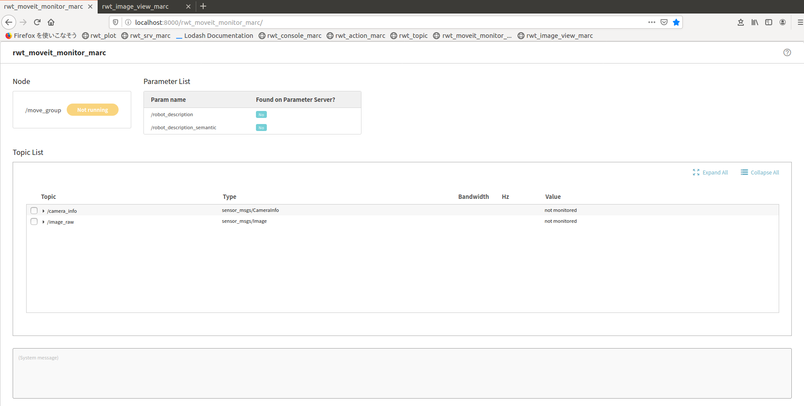

rwt_moveit_monitor_marc
========

Usage
-----
```sh
roslaunch rwt_moveit_monitor_marc rwt_moveit_monitor_marc.launch # this starts roswww and rosbridge_server and rwt_topic_content_marc
```

and access to http://localhost:8000/rwt_moveit_monitor_marc/ using your browser
Calling rwt_topic_content in iframe.



Dependencies
------------
All the dependending projects are included in `rwt_moveit_monitor_marc` and `rwt_topic_content_marc` and `rwt_utils_3rdparty`

* [SlickGrid](https://slickgrid.net/Index.html) - spreadsheet library
* [lodash](https://github.com/lodash/lodash) - utlity functions