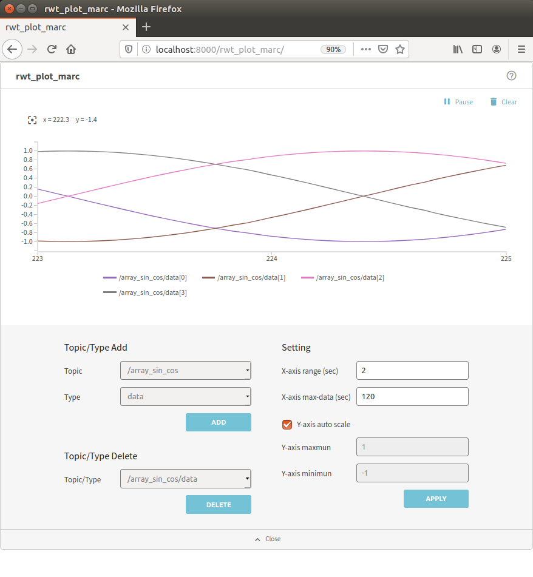

rwt_plot_marc
========

Usage
-----
```sh
roslaunch rwt_plot_marc rwt_plot_marc.launch # this starts roswww and rosbridge_server
```

and access to http://localhost:8000/rwt_plot_marc/ using your browser



Dependencies
------------
All the dependending projects are included in `rwt_plot_marc` and `rwt_utils_3rdparty`

* [jquery](http://jquery.com) - well-known library
* [lodash](https://github.com/lodash/lodash) - utlity functions
* [d3.js](http://d3js.org/) - graph library