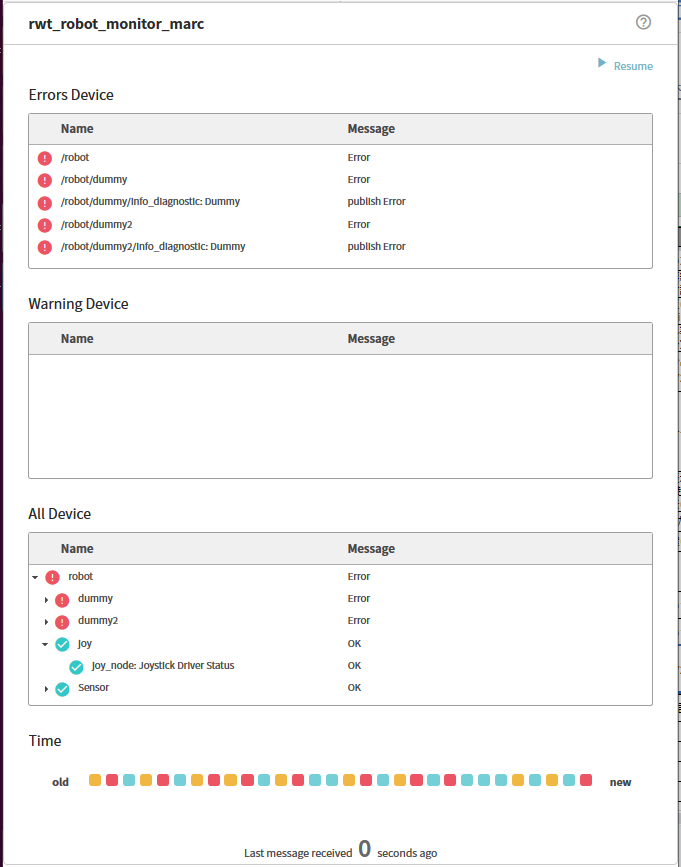

rwt_robot_monitor_marc
========

Usage
-----
```sh
roslaunch rwt_robot_monitor_marc rwt_robot_monitor_marc.launch # this starts roswww and rosbridge_server

and access to http://localhost:8000/rwt_robot_monitor_marc/ using your browser



Dependencies
------------
All the dependending projects are included in `rwt_robot_monitor_marc` and `rwt_utils_3rdparty`

* [jquery](http://jquery.com) - well-known library
* [lodash](https://github.com/lodash/lodash) - utlity functions