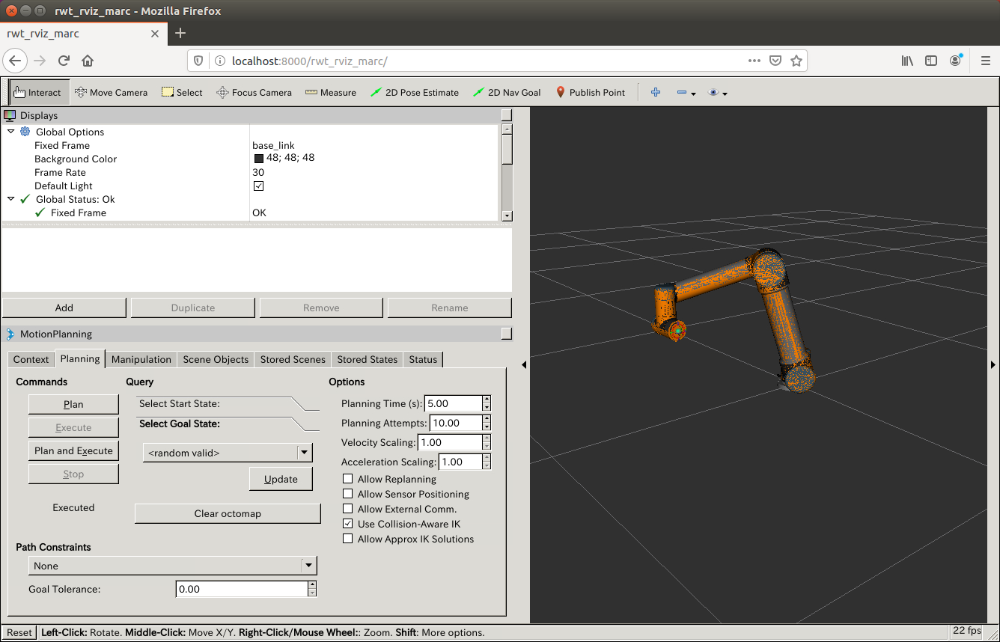

rwt_rviz_marc
==============

Installation
------------
1. Install TigerVNC Server and Websockify
    ```sh
    sudo apt install tigervnc-standalone-server websockify
    ```

2. Build ROS package
    ```
    cd <your_catkin_ws>/src

    git clone https://github.com/robo-marc/visualization_rwt.git

    rosdep install --ignore-src --from-paths visualization_rwt/rwt_rviz_marc -y

    catkin build rwt_rviz_marc

    source <your_catkin_ws>/devel/setup.bash
    ```

Usage
-----
```sh
roslaunch rwt_rviz_marc rwt_rviz_marc.launch
```

and access to http://localhost:8000/rwt_rviz_marc/ using your browser


