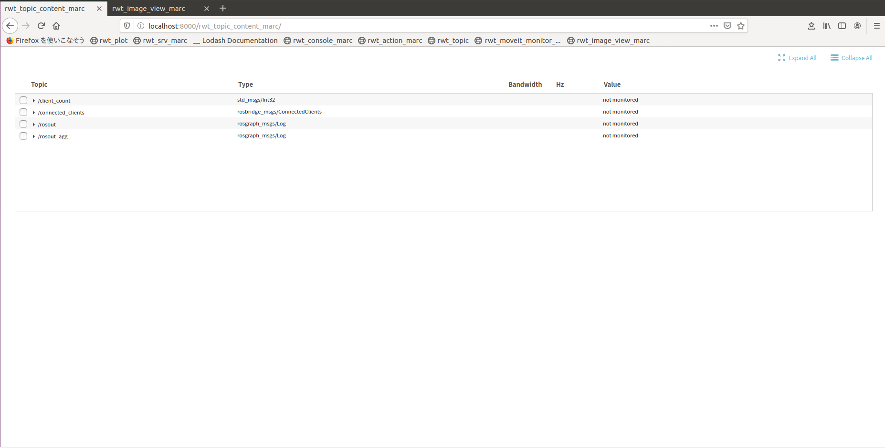

rwt_topic_content_marc
========

Usage
-----
```sh
roslaunch rwt_topic_content_marc rwt_topic_content_marc.launch # this starts roswww and rosbridge_server and node
```

and access to http://localhost:8000/rwt_topic_content_marc/ using your browser  
rwt_topic_content_marc does not work alone.  
A package that standardizes the processing of rwt_moveit_marc and rwt_topic_marc.



Dependencies
------------
All the dependending projects are included in `rwt_topic_content_marc` and `rwt_utils_3rdparty`

* [SlickGrid](https://slickgrid.net/Index.html) - spreadsheet library
* [lodash](https://github.com/lodash/lodash) - utlity functions
